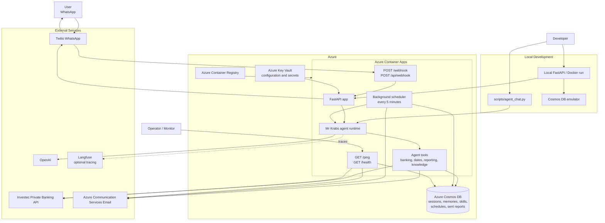
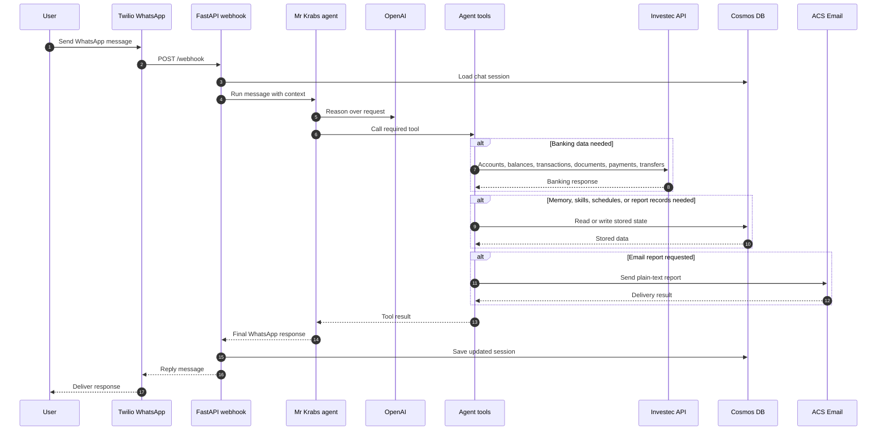
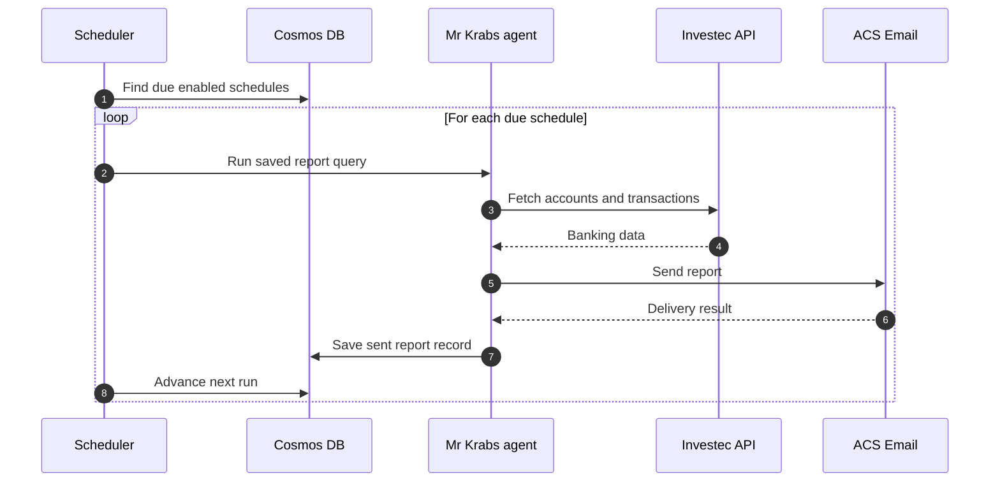

# Mr Krabs Solution Diagram

This diagram shows the deployed solution components and the main runtime paths for WhatsApp requests, banking/reporting tools, scheduled reports, and operational checks.

## Main Flows

## Scheduled Report Flow

