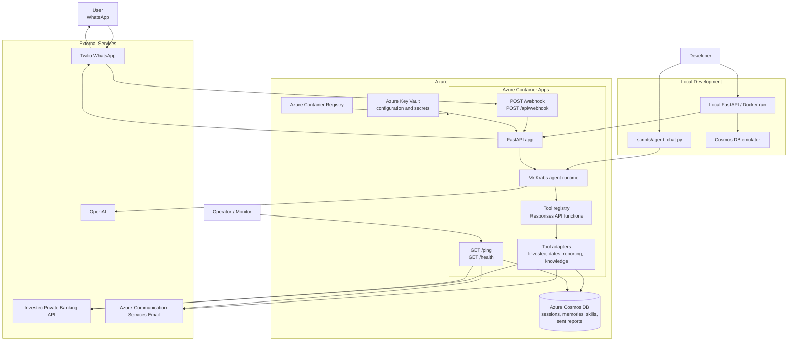
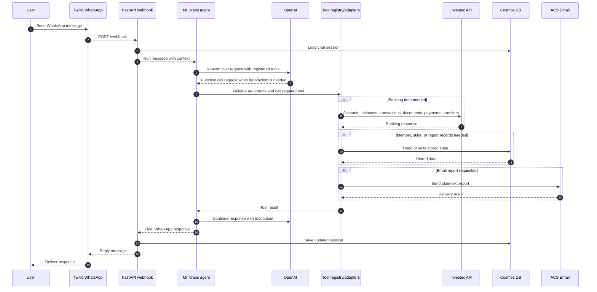

# Mr Krabs Solution Diagram

This diagram shows the deployed solution components and the main runtime paths for WhatsApp requests, banking/reporting tools, and operational checks.

## Main Flows

## Tool Composition

Investec tools are composed explicitly at the application boundary:

1. `InvestecClient` owns the HTTP-backed account, document, and payment clients.
2. `krabs_tools.tools.factories` groups concrete tool adapters by dependency: `create_investec_account_tools`, `create_investec_document_tools`, and `create_investec_payment_tools`.
3. `create_investec_tools` combines those groups for the normal app path.
4. `ToolRegistry.register_many` registers the resulting tools for the Responses API.
5. `krabs_agent.agent_runner` and `scripts/agent_chat.py` both use the same factory path.

This keeps external dependencies visible while avoiding one-by-one registration in every entry point.
