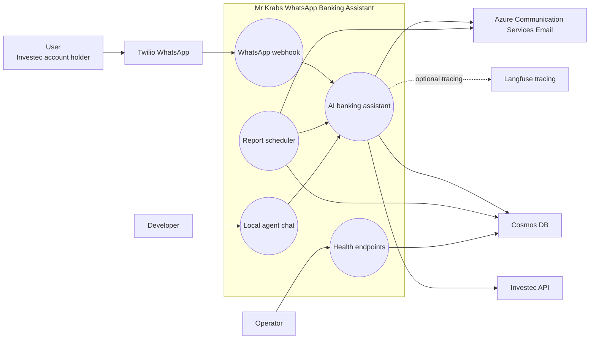
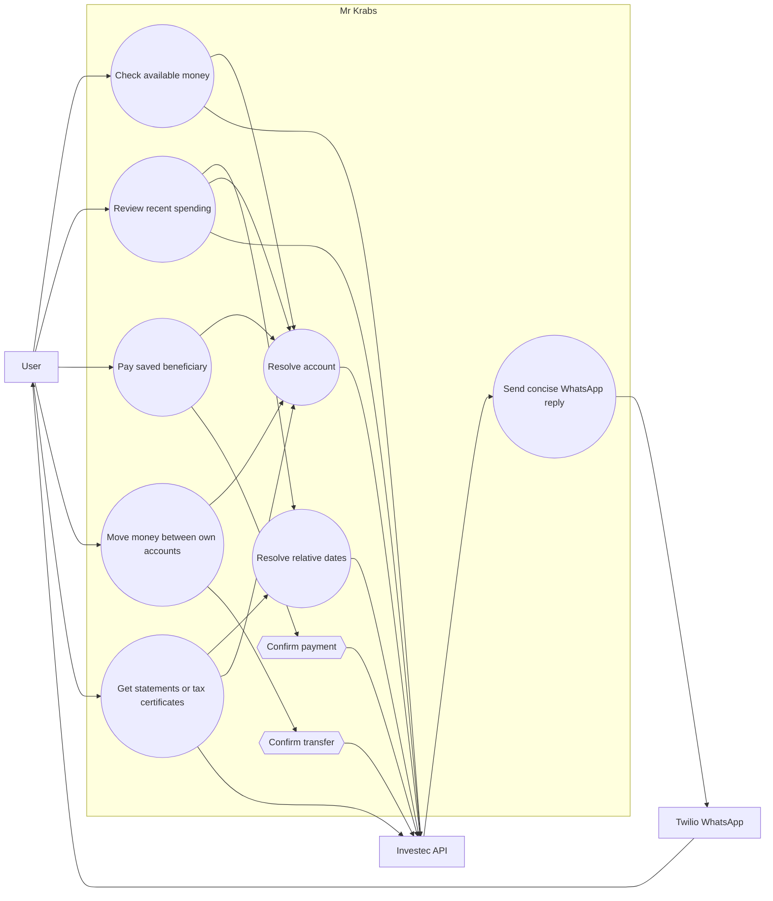
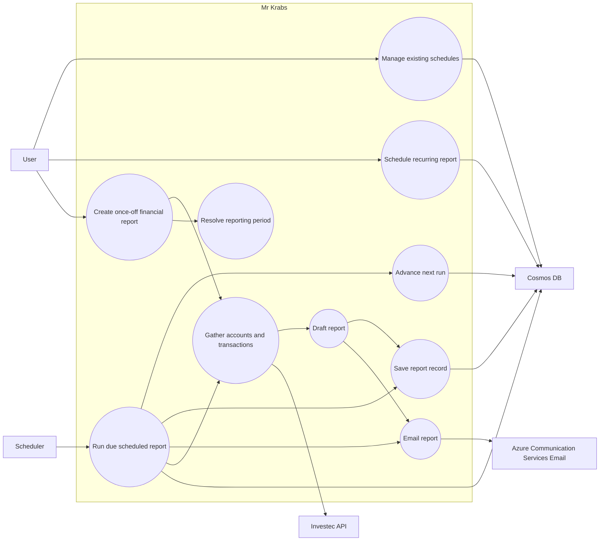
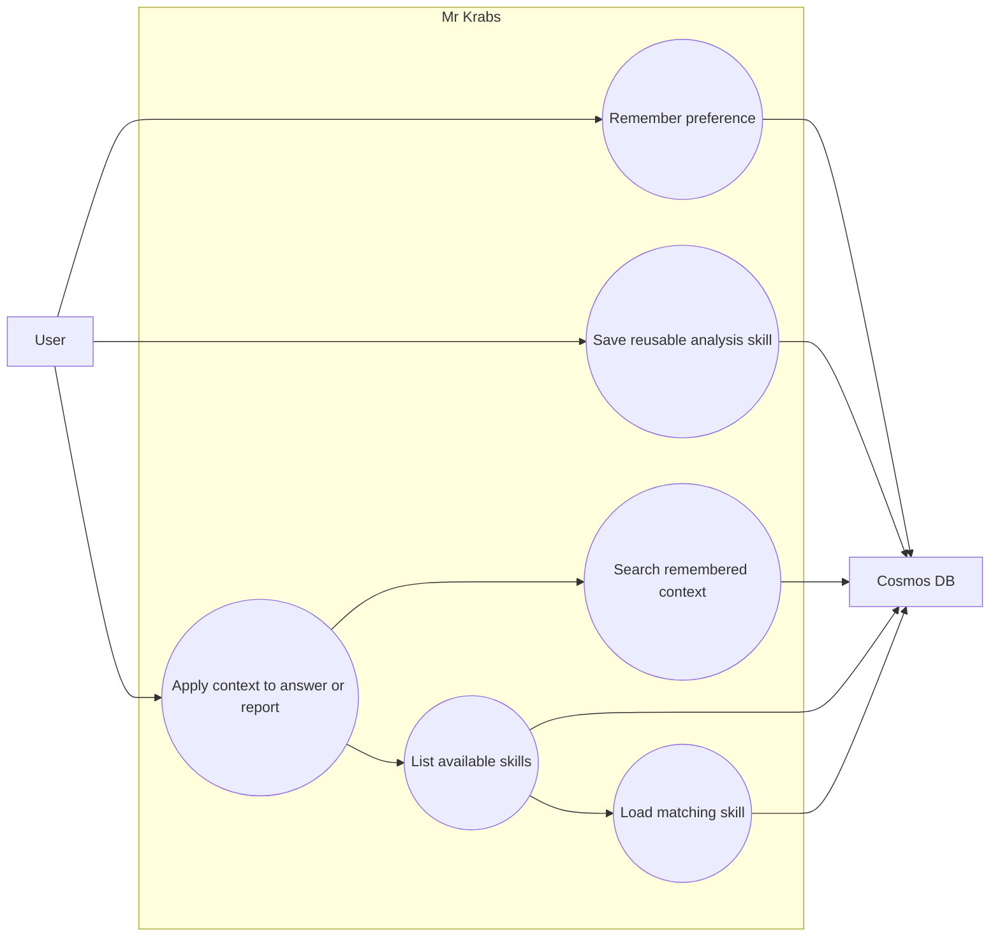
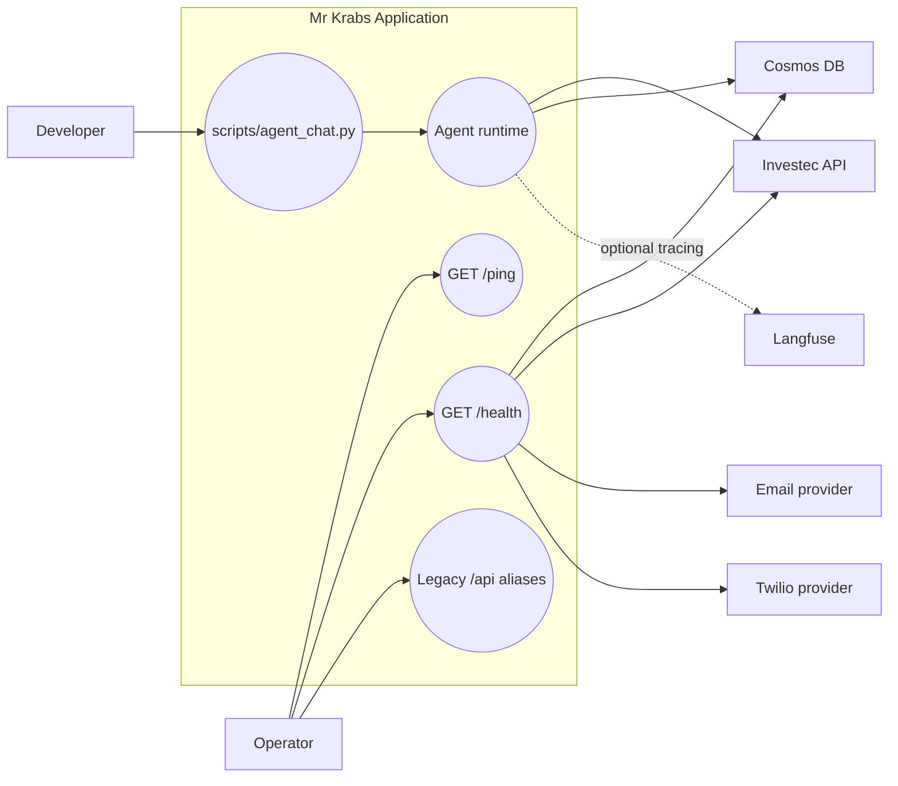
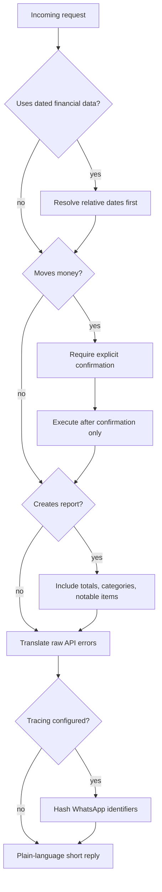

# Mr Krabs Use Case Diagrams

These diagrams summarize the use cases described in [use-cases.md](use-cases.md).

For the solution-level architecture view, see [solution-diagram.md](solution-diagram.md).

## System Context

## User Banking Requests

## Reports and Scheduling

## Memory and Reusable Skills

## Operations and Local Testing

## Cross-Cutting Constraints

